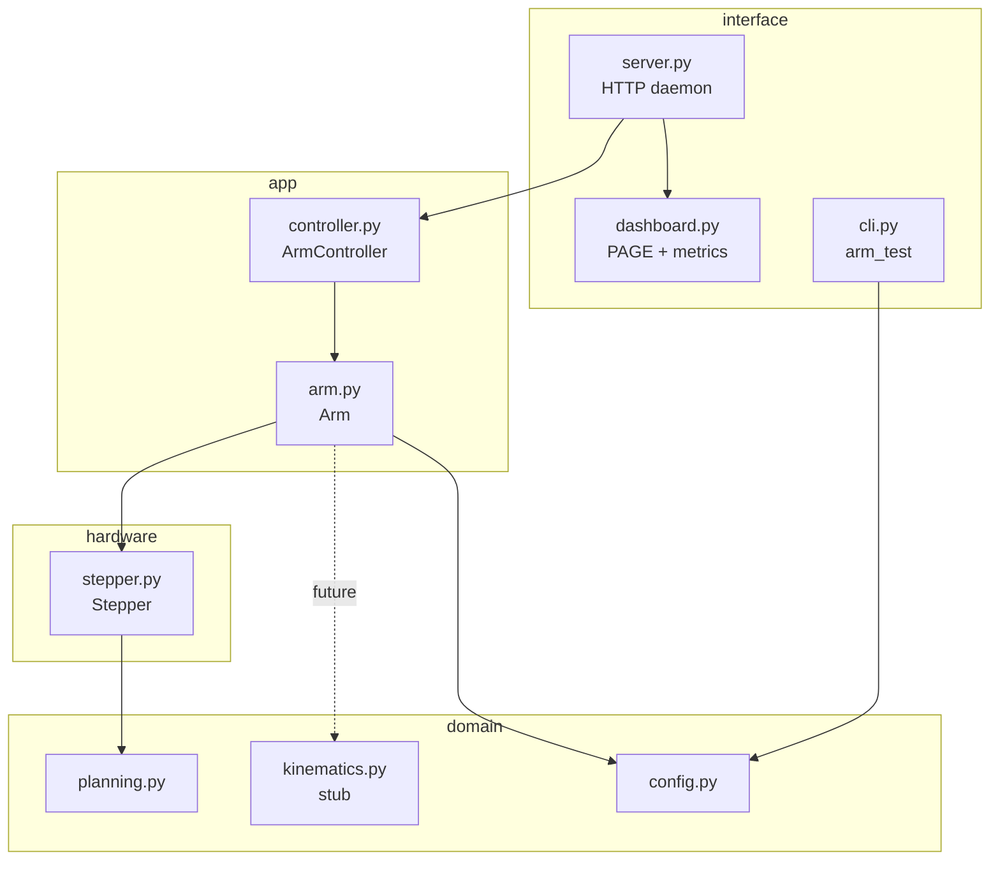

# Architecture

How the Money Sorter software is put together: the layers, every module, the
runtime model, and the mechanisms that matter (motion planning, the emergency
stop, homing, soft limits). Wiring/calibration is in [`PINOUT.md`](PINOUT.md);
how to drive it from a terminal is in [`USAGE.md`](USAGE.md).

## What it is

A vision-guided 3-axis stepper robot arm on a Raspberry Pi 4, working toward a
money sorter: a camera picks a target → inverse kinematics → the arm moves.
Today the motion stack, calibration, homing, e-stop, dashboard, and CLI are all
done; kinematics and the camera are next.

The three joints:

| Axis | Joint | STEP / DIR | Home switch | Range |
|------|-------|-----------|-------------|-------|
| **x** | elbow | GPIO5 / GPIO6 | GPIO7 | 0 … −90° |
| **y** | shoulder | GPIO17 / GPIO27 | GPIO8 | 0 … 90° |
| **z** | base | GPIO23 / GPIO24 | none (continuous) | 360° |

One shared enable line (GPIO26, active-low) energises all three drivers at once.

## Layering

The code is a single `moneysort/` package with four layers. **Dependencies point
inward** — an outer layer may import an inner one, never the reverse:

```
interface  →  app  →  hardware  →  domain
(HTTP/CLI)   (policy) (lgpio)     (pure logic)
                  ╲       │        ╱
                   ╲──── config ──╱      (shared, innermost)
```

Why: the inner layers have no idea HTTP or even `lgpio` exists, so the pure logic
(motion planning, and soon kinematics) is testable off the Pi and the hardware
can be swapped or mocked without touching policy. `config` is the shared innermost
node — the single source of truth for pins and calibration that every layer reads.



### Repository layout

```
moneysort/                 the package
  config.py                pins, calibration, PORT, GPIOCHIP (single source)
  domain/
    planning.py            trapezoidal motion profile (pure)
    kinematics.py          FK/IK (stub — needs measured link lengths)
  hardware/
    stepper.py             one STEP/DIR axis via lgpio.tx_pulse
  app/
    arm.py                 multi-axis coordination, homing, soft limits
    controller.py          serialize motion, latched e-stop, status
  interface/
    server.py              long-running daemon + HTTP API + dashboard
    dashboard.py           the HTML PAGE and system-metric helpers
    cli.py                 HTTP client used by arm_test.py
armd.py                    thin root shim → interface.server.main
arm_test.py                thin root shim → interface.cli.main
tests/                     pure-domain unit tests (no hardware)
deploy/                    deploy.sh, setup.sh, systemd unit, kiosk
docs/                      PINOUT, USAGE, ARCHITECTURE
```

The two root files are **shims** — `armd.py` just calls
`moneysort.interface.server.main()`. They exist so the systemd unit
(`ExecStart=… /armd.py`) and the documented `python3 arm_test.py …` command keep
working after the code moved into the package.

## The layers in detail

### domain — pure logic, no I/O

**`config.py`** — the only place pin numbers and calibration live:
- `PORT = 8080`, `GPIOCHIP = 0`, `ENABLE_PIN = 26`.
- `JOINTS` — per axis: `step`/`dir` BCM pins, `invert`, `steps_per_rev`
  (measured, folds in microstepping + gearing), `travel` (soft-limit span),
  `home_pin`, `home_dir` (sign of the step direction toward the switch).

**`planning.py`** — turns a signed step count into a trapezoidal speed profile,
as a list of `(pps, cycles)` bursts. No hardware, so it's unit-tested directly.
- `ramp_segs(ramp_steps, max_pps, min_pps, up)` — a rising or falling ramp in
  `k=16` sub-steps.
- `plan_segments(steps, max_pps, min_pps, accel_steps)` — ramp-up + cruise +
  ramp-down. The **cruise is chunked** into `~CRUISE_CHUNK_S` (40 ms) bursts
  rather than one long burst; this is what lets an e-stop interrupt promptly
  (see *Emergency stop* below). Direction is intentionally *not* handled here —
  it's a hardware concern.

**`kinematics.py`** — forward/inverse kinematics, implemented from the measured
geometry (upper arm 220 mm, forearm 310 mm, shoulder pivot 120 mm up). Model:
base yaw (z) + a 2-link planar arm in that plane (shoulder y from vertical,
forearm absolute `φ = y + 90 − x`). `forward(JointAngles) → Point`,
`inverse(Point) → JointAngles` (home elbow branch, raises `OutOfReach` beyond the
links or joint limits), plus `reachable()`. Fully unit-tested (FK↔IK round-trip).
Pending on-arm validation of the geometry and the *relative*-elbow assumption.

### hardware — `stepper.py`

`Stepper` drives one axis's STEP/DIR pins through `lgpio.tx_pulse`, which emits a
**hardware-timed** pulse train. (A Python `time.sleep()` loop tops out ~1–2 kHz;
`tx_pulse` pushes tens of kHz for smooth, fast motion.) Each `Stepper`:
- owns its STEP and DIR pins on the shared gpiochip handle;
- holds calibration (`eff_spr`), speed limits (`min_pps` 400, `max_pps` 20000),
  `accel_steps` (800), and a shared `abort` `threading.Event`;
- tracks `position` (net steps from home) and exposes `angle`.

Key methods:
- `plan(steps)` → `(dir_level, segs)` — asks `planning.plan_segments` for the
  magnitude profile, then adds the direction bit (`sign(steps) XOR invert`).
- `move(steps)` — set DIR, feed every burst via `_burst` (blocks on `tx_room`),
  wait for the train to drain, update `position`.
- `try_queue(pps, cycles)` — non-blocking single-burst enqueue; used by the
  multi-axis interleaver.
- `jog(steps, pps)` — constant-speed, no ramp; the small increments used in
  homing.
- `home_seek(direction, pps, stop_fn)` — ramp up then cruise on an **infinite**
  burst, polling `stop_fn()`; on contact, a fresh `tx_pulse` truncates the
  infinite train (only infinite bursts can be cut short — this is why the normal
  cruise is chunked instead).

Every method checks `abort` so an e-stop stops the feed at once.

### app — orchestration and policy

**`arm.py` (`Arm`)** owns the gpiochip handle, the shared enable pin, and one
`Stepper` per axis (all sharing one `abort` event). It adds everything that spans
axes or needs the machine's state:
- `enable()` / `disable()` — drive the shared enable pin. `disable()` also **sets
  `abort`** and **clears `homed`** (positions are unknown after an abrupt stop).
- soft limits — `_limits[axis] = (lo, hi)` derived from `travel` + `home_dir`,
  enforced by `_clamp_steps` **only once the axis is in `homed`**.
- `move` / `move_degrees` — single axis, clamped.
- `move_many(moves)` — coordinated multi-axis: plan each axis, set all DIRs, then
  round-robin `try_queue` their bursts so every axis ramps and runs together.
- `find_home(axis)` — two-stage homing (below); adds the axis to `homed`.
- `home_all()` — x/y `find_home`, switch-less z `go_home` (back to zero).
- `return_zero()` — every axis back to tracked zero, no switch seek.
- `zero()` — define the current position as 0.
- `at_home` / `_stable_home` — read a home switch (debounced).

`Arm` knows nothing about HTTP; it's pure motion policy over the hardware.

**`controller.py` (`ArmController`)** wraps `Arm` with the concurrency and safety
policy the delivery layer needs:
- a `_move_lock` so only **one move runs at a time**;
- `_run(fn)` — refuses to start if `estopped`, else runs `fn` while flagging
  `moving`;
- `disable()` sets a **latched** `estopped` (moves are refused until `enable()`),
  and is safe to call mid-move — it hits the enable pin + `abort` directly,
  outside the lock;
- `status()` — joints (°), `moving`, `enabled`, `estopped`, per-switch `home`
  reads, and the `homed` set.

### interface — delivery

**`server.py`** is the daemon (systemd `moneysort-arm`). It constructs the single
`ArmController` (so there is exactly one GPIO owner for the process's life — which
is what makes the e-stop *latched*), and serves a `ThreadingHTTPServer` on
`0.0.0.0:PORT`. `build_status()` merges `ArmController.status()` with host metrics
from `dashboard`. `SIGTERM`/`SIGINT` shut the server down and `close()` the arm.

HTTP API:

| Method | Path | Body | Action |
|--------|------|------|--------|
| GET | `/` | — | dashboard page |
| GET | `/status` | — | system + arm state (JSON) |
| POST | `/move` | `{axis,steps,pps}` or `{moves:{…},pps}` | move one / several axes |
| POST | `/find_home` | `{axis}` | home one switch axis |
| POST | `/home` | `{pps?}` | home all (x/y seek, z→0) |
| POST | `/return_zero` | `{pps?}` | all axes back to zero |
| POST | `/zero` | — | set current position as 0 |
| POST | `/disable` | — | latched e-stop + abort |
| POST | `/enable` | — | clear e-stop |
| POST | `/kiosk-exit`, `/reboot`, `/poweroff` | — | system control |

**`dashboard.py`** is pure presentation: the single `PAGE` string (dark,
touch-first, 1280×800; polls `/status` every 1.5 s; Return-to-zero, Home in a
Settings disclosure, e-stop, themed toasts) plus stdlib metric helpers
(`cpu_temp_c`, `mem_pct`, `ip_addr`, …). It touches no GPIO and runs no server of
its own — `server.py` imports `PAGE` and the helpers.

**`cli.py`** parses argv into one HTTP POST to the daemon (`build_request` →
single move / multi-axis / home). Reached via the `arm_test.py` shim.

## Request lifecycle

A move from the dashboard or CLI:

```
client ──HTTP POST /move──▶ server.Handler.do_POST
        └▶ ArmController.move()            refuse if estopped; take _move_lock
             └▶ Arm.move()                 clamp to soft limits (if homed)
                  └▶ Stepper.move()        plan → set DIR
                       └▶ planning.plan_segments()   (pure) → [(pps,cycles)]
                       └▶ lgpio.tx_pulse() per burst  → hardware pulse train
        ◀── JSON {ok, …status} ───────────  after the train drains
```

Each STEP pin has its own `lgpio` transmit queue that plays independently, which
is what makes `move_many` possible: the interleaver feeds all axes' queues
round-robin so they ramp and cruise together.

## Key mechanisms

### Trapezoidal motion + cruise chunking
A move ramps up (avoids stalling from a standstill), cruises at `max_pps`, ramps
down. `lgpio` plays a **finite** burst to completion no matter what, so the cruise
is split into ~40 ms bursts instead of one long one. That's not for smoothness —
it's so an emergency stop can take effect within a burst instead of after a
multi-second cruise finishes.

### Emergency stop (latched, aborts motion)
`disable()` does three things at once: drives the enable pin HIGH (**torque off
instantly** — the real safety), sets the shared `abort` event (every move/home
loop stops feeding and drains within a burst), and clears `homed`. It's latched:
`estopped` stays set and `_run` refuses new moves until `enable()`. Because the
feed stops and the short queued bursts drain fast, re-enabling can't lurch the
arm through a pile of leftover queued rotation.

### Coordinated multi-axis (`move_many`)
Plan every axis, set all DIR pins, then loop: for each still-pending axis, try to
enqueue its next burst if its queue has room; sleep when all queues are full.
All axes accelerate and run concurrently; positions update once every train ends.

### Homing (`find_home`) + soft limits
Two-stage: a fast `home_seek` to first contact, back off until released plus
clearance, then a slow `jog` approach until the switch reads **stably** triggered
(`_stable_home` debounces, so an axis resting on the switch edge still seats
firmly). That point becomes position 0 and the axis joins `homed`, which activates
its soft limits (`_clamp_steps` trims any move that would overtravel `0..travel`).
Switches are normally-closed to GND with the internal pull-up: not-home = LOW,
at-home / broken wire = HIGH (fail-safe). *Note:* the homing seek has **no
timeout** (deliberately removed) — it relies on the switches being wired.

### Position & degrees
`Stepper.position` is net steps from home; `angle = position / eff_spr * 360`.
`eff_spr` (steps per rev) is the measured calibration, so degrees are accurate
per axis. z is continuous; x/y are soft-limited once homed.

## Runtime & deploy

- One process (`armd` / systemd `moneysort-arm`) **owns all GPIO for its
  lifetime** — the reason the e-stop can latch (a short-lived script would free
  the pin, re-enabling, on exit).
- It runs on the Pi's **system** Python (`ExecStart=/usr/bin/python3 …/armd.py`),
  which provides `lgpio` via the OS package. The venv is only for dev tooling —
  **don't** pip-install `lgpio` (it builds from source and needs `swig`).
- The dashboard is shown fullscreen on the Pi via `kiosk.sh` (Chromium kiosk,
  launched from labwc autostart) and is reachable from any LAN PC at
  `http://money-sorter.local:8080`.
- **Deploy:** author in this repo → commit/push → `bash
  ~/projects/moneysort/deploy/deploy.sh` on the Pi (git pull → venv → pip →
  restart). Never edit or run code directly on the Pi (see `CLAUDE.md`).

## Testing

`python3 -m unittest discover tests` runs the pure-domain tests (motion planning:
step conservation, speed bounds, cruise chunking, ramp shape) with **no hardware
needed** — the payoff of keeping `domain/` free of `lgpio`. Kinematics tests will
join them once the solver is implemented.

## What's next

- **Inverse kinematics** — implemented in `domain/kinematics.py` and unit-tested;
  next validate it against the real arm, then expose a "move to point" path
  (`Arm.move_to(point)` → `inverse` → `move_many`) with a `/move_to` endpoint.
- **Camera (Intel RealSense)** — a new interface/adapter that detects a target,
  transforms it into the arm's base frame, and feeds IK. `pyrealsense2` on the
  Pi is the risky install (may need building) — de-risk with an import spike.
- **Visual servoing** — a setpoint-tracking controller is the eventual model,
  deferred until IK + camera are in.
